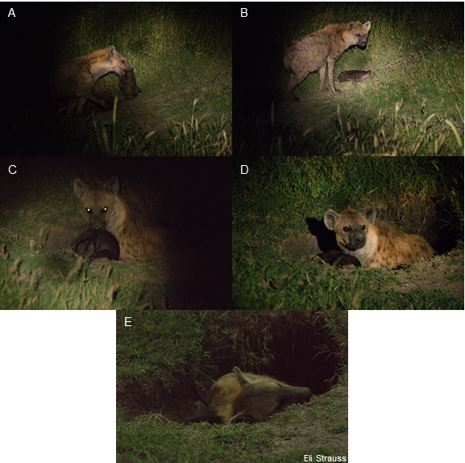

```{r setup, include=FALSE, echo = FALSE}

library(brms)
load('Data/age_model.RData')
load('Data/prey_and_cub_models.RData')

```

## Photos of mother caring for deceased offspring

In this observation



## Model detail and diagnostic for moratlity ~ age at death 

Here we used a multinomial model of mortality source as a function of age at death to understand the contribution of different mortality sources to overall mortality. This model was initialized with weak, uninformative priors, and four chains were run for 30000 iterations each (15000 warmup). 

#### Model summary and diagnostic

```{r age at death model - summary}

# Priors
prior_summary(fit)

summary(fit)

par(mfrow = c(3, 3))
mcmc_plot(fit, type = 'trace') ## Traceplots indicate convergence

rhat(fit)
```
## Model detail and diagnostic for moratlity ~ prey density 

Here we used a multinomial model of mortality source as a function of prey density. This model was initialized with weak, uninformative priors, and four chains were run for 30000 iterations each (15000 warmup). 

#### Model summary and diagnostic

```{r prey model - summary}

# Priors
prior_summary(prey_mod)

summary(prey_mod)

par(mfrow = c(3, 3))
mcmc_plot(prey_mod, type = 'trace') ## Traceplots indicate convergence

rhat(prey_mod)
```

```{r prey mode - plot, echo = FALSE}
## Predicted effect of cub density on the probability of infanticide
pred <- posterior_epred(prey_mod, newdata = data.frame(prey_density = seq(from = 0,
                                                                                   to = max(prey.test.data$prey_density), 
                                                                                   length.out = 100)),
                        nsamples = 200)

smooth.probs <- data.frame(apply(pred, c(2,3), mean))
smooth.probs$prey_density <- seq(from = 0,
                                   to = max(prey.test.data$prey_density), 
                                   length.out = 100)
smooth.probs.high <- data.frame(apply(pred, c(2,3), quantile, 0.95))
smooth.probs.high$prey_density <- seq(from = 0,
                                        to = max(prey.test.data$prey_density), 
                                        length.out = 100)
smooth.probs.low <- data.frame(apply(pred, c(2,3), quantile, 0.05))
smooth.probs.low$prey_density <- seq(from = 0,
                                     to = max(prey.test.data$prey_density), 
                                     length.out = 100)


par(mfrow = c(2,4),
    mar = c(0,0,0,0),
    oma = c(4,4,1,1), family = 'sans')
for(i in 1:7){
  plot(x = log(smooth.probs$prey_density), y = smooth.probs[,i], type = 'l', ylim = c(0,1),
       xaxt = 'n', yaxt = 'n')
  lines(x = log(smooth.probs.low$prey_density), y = smooth.probs.low[,i], type = 'l', lty = 2)
  lines(x = log(smooth.probs.high$prey_density), y = smooth.probs.high[,i], type = 'l', lty = 2)
  title(main = names(smooth.probs)[i], line = -2)
  if(i == 5)
    mtext('Probability of mortality source', side = 2, line = 2,at = 1)
  
  if(i == 6)
    mtext('Prey density', side = 1, line = 2)
  
  if(i %in% c(1,5))
    axis(side = 2, at = c(0,0.5, 1), labels = TRUE, outer = TRUE)
  
  if(i %in% c(5,6,7))
    axis(side = 1, at = c(0,500,1000), labels = TRUE, outer = TRUE)
}

```

## Model detail and diagnostic for mortality ~ cub density

Here we used a multinomial model of mortality source as a function of cub density. This model was initialized with weak, uninformative priors, and four chains were run for 30000 iterations each (15000 warmup). 

#### Model summary and diagnostic

```{r cub density model - summary}

# Priors
prior_summary(cub_density_mod)

summary(cub_density_mod)

par(mfrow = c(3, 3))
mcmc_plot(cub_density_mod, type = 'trace') ## Traceplots indicate convergence

rhat(cub_density_mod)

```

```{r cub density model - plot, echo = FALSE}
## Predicted effect of cub density on the probability of infanticide
pred <- posterior_epred(cub_density_mod, newdata = data.frame(cub_associates = seq(from = 0,
                                                                                     to = max(cub.density.test.data$cub_associates), 
                                                                                     length.out = 100)),
                          nsamples = 200)

smooth.probs <- data.frame(apply(pred, c(2,3), mean))
smooth.probs$cub_associates <- seq(from = 0,
                                   to = max(cub.density.test.data$cub_associates), 
                                   length.out = 100)
smooth.probs.high <- data.frame(apply(pred, c(2,3), quantile, 0.95))
smooth.probs.high$cub_associates <- seq(from = 0,
                                        to = max(cub.density.test.data$cub_associates), 
                                        length.out = 100)
smooth.probs.low <- data.frame(apply(pred, c(2,3), quantile, 0.05))
smooth.probs.low$cub_associates <- seq(from = 0,
                                       to = max(cub.density.test.data$cub_associates), 
                                       length.out = 100)


par(mfrow = c(2,4),
    mar = c(0,0,0,0),
    oma = c(4,4,1,1), family = 'sans')
for(i in 1:7){
  plot(x = smooth.probs$cub_associates, y = smooth.probs[,i], type = 'l', ylim = c(0,1),
       xaxt = 'n', yaxt = 'n')
  lines(x = smooth.probs.low$cub_associates, y = smooth.probs.low[,i], type = 'l', lty = 2)
  lines(x = smooth.probs.high$cub_associates, y = smooth.probs.high[,i], type = 'l', lty = 2)
  title(main = names(smooth.probs)[i], line = -2)
  if(i == 5)
    mtext('Probability of mortality source', side = 2, line = 2,at = 1)

  if(i == 6)
    mtext('Cub density at den', side = 1, line = 2)
  
  if(i %in% c(1,5))
    axis(side = 2, at = c(0,0.5, 1), labels = TRUE, outer = TRUE)
  
  if(i %in% c(5,6,7))
    axis(side = 1, at = c(0,7,14), labels = TRUE, outer = TRUE)
}

```


